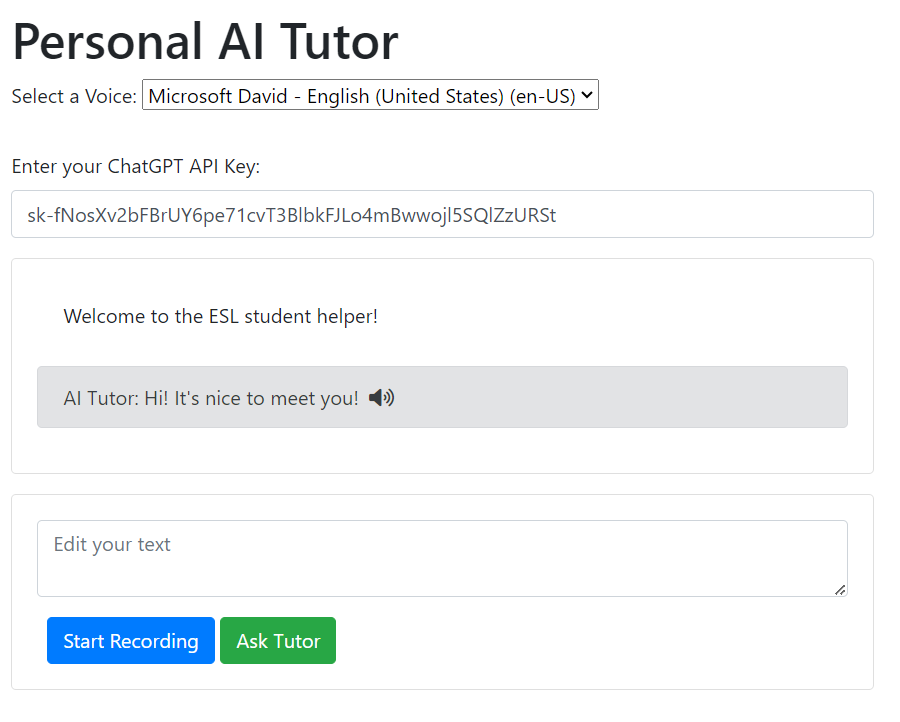

# Personal AI Language Tutor using ChatGPT
A simple webapp created using HTML, Bootstrap, and the Web Kit to allow Spanish learners to interact with an AI tutor.

## How to use
Go to the Github pages link and enter a ChatGPT API Key. Then you can either speak or type to the AI and it will respond to you. Then click the `Ask Tutor` button to send it to ChatGPT.

## How to get a ChatGPT API Key
Go to [ChatGPT](https://platform.openai.com/account/api-keys) and click `Get API Key`. Then you can generate an API key to use.